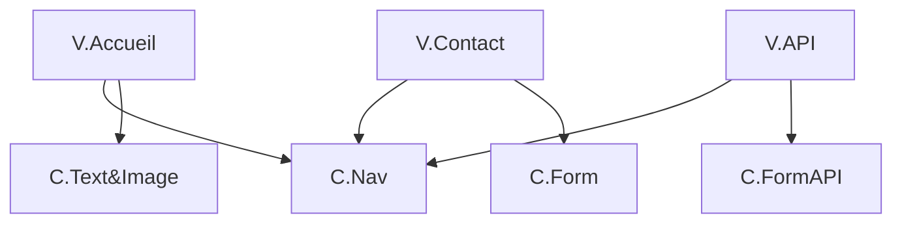

# projet-vue

## Project setup
```
npm install
```

### Compiles and hot-reloads for development
```
npm run serve
```
#### Si Bug lor du lancement : 
```
npm install vue-router@3
```

#### Voir la version de VUE :
npm list vue

### Compiles and minifies for production
```
npm run build
```

### Lints and fixes files
```
npm run lint
```

### Customize configuration
See [Configuration Reference](https://cli.vuejs.org/config/).


# Arborescence : 

